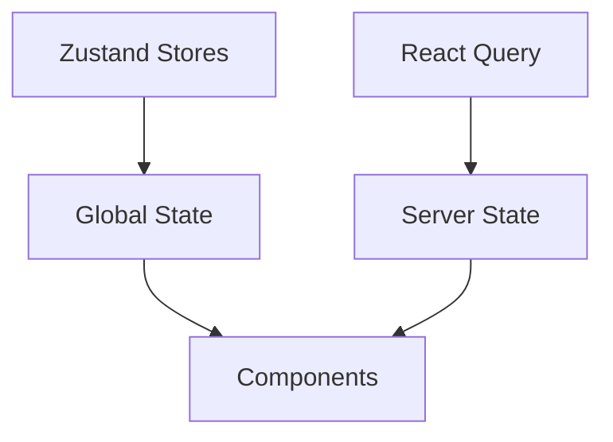

# Pro React Boilerplate (Client) 🔥

A modern React-based frontend boilerplate with authentication-ready architecture, built with Vite, TypeScript, and Tailwind CSS.


## Features ✨

### Core Stack

- ⚡ **Vite** - Next-gen frontend tooling
- 🦄 **React 18** - With concurrent features
- 🎨 **Tailwind CSS** - With `tailwind-merge` and `tailwindcss-animate`
- 🏷️ **TypeScript** - Full type safety
- 🌐 **i18n** - Internationalization with `react-i18next`

### UI Components

- 🧩 **Radix UI Primitives** - Accessible unstyled components
- ✨ **ShadCN-inspired** - Using `class-variance-authority` for variants
- 🎉 **Lucide Icons** - Beautiful SVG icons
- 📅 **Date Utilities** - `date-fns` for date handling
- 🔔 **Sonner** - Elegant toast notifications
- 🏗️ **VAUL** - Modern drawer component

### State Management

- 🐻 **Zustand** - Simple state management
- 🗃️ **React Query** - Data fetching/caching (with DevTools)
- 📝 **React Hook Form** - Form handling with Zod validation

### Routing & Navigation

- 🚦 **React Router v6** - Client-side routing

### Mocking & Testing

- 🎭 **MSW** - API mocking for development
- ✅ **ESLint** - Code quality checks

## Project Structure 📂

```bash
src/
├── api/               # API request handlers
├── components/        # Reusable UI components
├── hooks/            # Custom React hooks
├── i18n/             # Internationalization config
├── lib/              # Utility functions
├── mocks/            # Mock API handlers
├── pages/            # Page components
├── providers/        # Context providers
├── routes/           # Route configurations
├── stores/           # Zustand stores
├── types/            # Type definitions
├── App.tsx           # Main app component
├── main.tsx          # Entry point
├── index.css         # Global styles
└── vite-env.d.ts     # Vite type declarations
```

## Getting Started 🚀

### Prerequisites

- Node.js v18+
- npm/yarn/pnpm/bun

### Development

```bash
# Start dev server
npm run dev

# Dev server with mock API
npm run dev:mock
```

### Build

```bash
npm run build
```

### Linting

```bash
npm run lint
```

## Key Configuration Files

### `vite.config.ts`

- React plugin
- Absolute path resolution
- Environment variables

### `tailwind.config.js`

- Custom theme configuration
- Animation utilities
- Plugin integrations

### `i18n/config.ts`

- Language detection
- Resource loading
- React integration

## Mock API Setup

1. Start dev server with mocks:

    ```bash
    npm run dev:mock
    ```

2. Edit mock handlers in `src/mocks/`

## Styling Approach

- **Utility-first** with Tailwind CSS
- **CSS Variables** for theming
- **CVA** for component variants
- **clsx** for conditional classes

## State Management Architecture



## Internationalization

1. Add translations in `public/locales/{lang}/translation.json`
2. Use hooks in components:

```tsx
const { t } = useTranslation();
return <div>{t('welcome_message')}</div>;
```

## Deployment

The project is ready to deploy to:

- Vercel
- Netlify
- Cloudflare Pages
- Any static host

## Recommended VS Code Extensions

- ESLint
- Tailwind CSS IntelliSense
- i18n Ally
- Zod TypeScript
